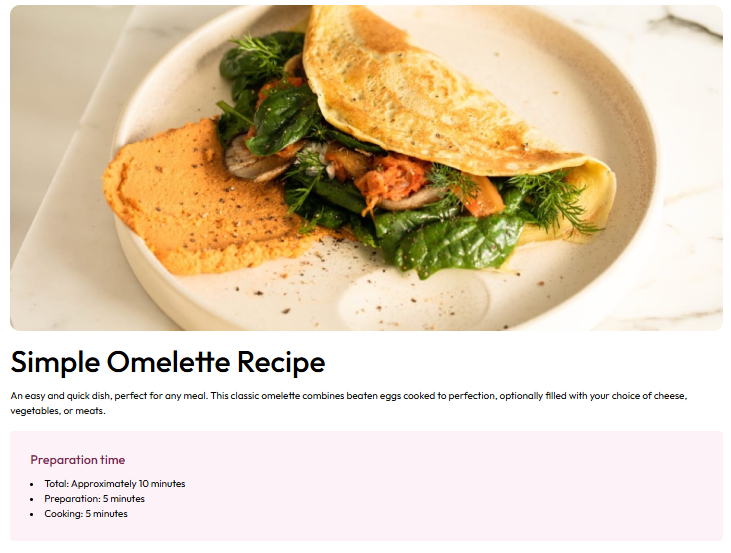

# Frontend Mentor - Recipe page solution

This is a solution to the [Recipe page challenge on Frontend Mentor](https://www.frontendmentor.io/challenges/recipe-page-KiTsR8QQKm). Frontend Mentor challenges help you improve your coding skills by building realistic projects. 

## Table of contents

- [Overview](#overview)
  - [The challenge](#the-challenge)
  - [Screenshot](#screenshot)
  - [Links](#links)
- [My process](#my-process)
  - [Built with](#built-with)
  - [What I learned](#what-i-learned)
  - [Continued development](#continued-development)
  - [Useful resources](#useful-resources)
- [Author](#author)
- [Acknowledgments](#acknowledgments)

## Overview

### Screenshot

### Links

- Solution URL: [here](https://github.com/lhnhidev/-practice--1)
- Live Site URL: [here](https://lhnhidev.github.io/-practice--1/)

## My process

### Built with

- Semantic HTML5 markup
- CSS custom properties
- Flexbox
- CSS Grid
- Mobile-first workflow
- [Tailwind CSS](https://v3.tailwindcss.com/) - For styles

### Continued development

Use this section to outline areas that you want to continue focusing on in future projects. These could be concepts you're still not completely comfortable with or techniques you found useful that you want to refine and perfect.

### Useful resources

- [Tailwind CSS](https://v3.tailwindcss.com/docs/installation) - This helped me for code promtply css reason. I really liked this pattern and will use it going forward.
- [Chat GPT]('https://chatgpt.com/') - Perfect! i think you know it!

## Author

- Github - [lhnhidev](https://github.com/lhnhidev)
- Frontend Mentor - [@lhnhidev](https://www.frontendmentor.io/profile/lhnhidev)
- Facebook - [Lê Hoàng Nhi](https://www.facebook.com/le.hoang.nhi.404070/)

## Acknowledgments

This is where you can give a hat tip to anyone who helped you out on this project. Perhaps you worked in a team or got some inspiration from someone else's solution. This is the perfect place to give them some credit.

Thanks to [Frontend Mentor](https://www.frontendmentor.io) for providing this challenge.  
Also, a big shout-out to the community and anyone who checked out my project!

If you found this project helpful, please consider giving it a ⭐ — it really motivates me! 😊
